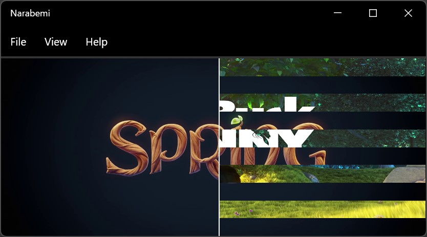

# Narabemi

A side-by-side video player with a horizontal comparison slider.

## Screenshots


*© Blender Foundation | [cloud.blender.org/spring](http://cloud.blender.org/spring)*

### Custom Blend Shader



```hlsl
float4 main(float2 uv : TEXCOORD) : COLOR
{
    float4 color0 = tex2D(input0, uv);
    float4 color1 = tex2D(input1, uv);
    float4 color = lerp(color0, color1, step(ratio, uv.x) * saturate(step(uv.y % 0.2, 0.1))); // stripe blend
    return lerp(color, borderColor,
        step(uv.x - (borderWidth / widthPx / 2.0f), ratio) *
        step(ratio, uv.x + borderWidth / widthPx / 2.0f));
}
```

### Comparing Subtitles


## Installation

### Download

- [Releases](https://github.com/ugai/narabemi/releases)

### Set FFmpeg path

1. [Download](https://ffmpeg.org/download.html) the FFmpeg 4.4 binary and put it somewhere.
2. Edit the `AppSettings.json` file to set the path to FFmpeg's `bin` directory.

Or just run the `download_ffmpeg.bat` file.

## Limitations

- Video playback synchronization is not frame-accurate, not perfect.

## Better Alternatives

- [Image Comparison & Analysis Tool (ICAT)](https://www.nvidia.com/en-us/geforce/technologies/icat/)
- [video-compare](https://github.com/pixop/video-compare)
- [GridPlayer](https://github.com/vzhd1701/gridplayer)
- [Syncplay](https://github.com/Syncplay/syncplay)
- [FFmpeg - Create a mosaic out of several input videos](https://trac.ffmpeg.org/wiki/Create%20a%20mosaic%20out%20of%20several%20input%20videos)

## License

MIT license
